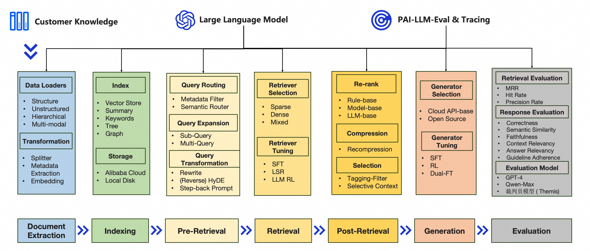

<p align="center">
    <h1>PAI-RAG: An easy-to-use framework for modular RAG </h1>
</p>

[](https://github.com/aigc-apps/PAI-RAG/actions/workflows/ci.yml)

<p align="center">
  <a href="./README.md">English</a> |
  <a href="./README_zh.md">简体中文</a> |
</p>

<details open>
<summary></b>📕 Contents</b></summary>

- 💡 [What is PAI-RAG?](#what-is-pai-rag)
- 🌟 [Key Features](#key-features)
- 🔎 [Get Started](#get-started)
  - [Local](#run-in-local-environment)
  - [Docker](#run-in-docker)
- 🔧 [Documents](#documents)

</details>

# 💡 What is PAI-RAG?

PAI-RAG is an easy-to-use opensource framework for modular RAG (Retrieval-Augmented Generation). It combines LLM (Large Language Model) to provide truthful question-answering capabilities, supports flexible configuration and custom development of each module of the RAG system. It offers a production-level RAG workflow for businesses of any scale based on Alibaba Cloud's Platform of Artificial Intelligence (PAI).

# 🌟 Key Features



- Modular design, flexible and configurable
- Powerful RAG capability: multi-modal rag, agentic-rag and nl2sql support
- Built on community open source components, low customization threshold
- Multi-dimensional automatic evaluation system, easy to grasp the performance quality of each module
- Integrated llm-based-application tracing and evaluation visualization tools
- Interactive UI/API calls, convenient iterative tuning experience
- Alibaba Cloud fast scenario deployment/image custom deployment/open source private deployment

# 🔎 Get Started

## Run in Local Environment

1. Clone Repo

   ```bash
   git clone git@github.com:aigc-apps/PAI-RAG.git
   ```

2. Development Environment Settings

   This project uses poetry for management. To ensure environmental consistency and avoid problems caused by Python version differences, we specify Python version 3.11.

   ```bash
   conda create -n rag_env python==3.11
   conda activate rag_env
   ```

   if you use macOS and need to process PPTX files, you need use the following command to install the dependencies to process PPTX files:

   ```bash
      brew install mono-libgdiplus
   ```

   Use poetry to install project dependency packages directly:

   ```bash
   pip install poetry
   poetry install
   poetry run aliyun-bootstrap -a install
   ```

- Common network timeout issues

  Note: During the installation, if you encounter a network connection timeout, you can add the Alibaba Cloud or Tsinghua mirror source and append the following lines to the end of the pyproject.toml file:

  ```bash
  [[tool.poetry.source]]
  name = "mirrors"
  url = "http://mirrors.aliyun.com/pypi/simple/" # Aliyun
  # url = "https://pypi.tuna.tsinghua.edu.cn/simple/" # Qsinghua
  priority = "default"
  ```

  After that, execute the following commands:

  ```bash
  poetry lock
  poetry install
  ```

3. Download Models:

   Download models (embedding/pdf-extractor/reranker models) using `load_model` command:

   ```bash
   # Support model name (default ""), download all models mentioned before without parameter model_name.
   load_model [--model-name MODEL_NAME]
   ```

4. Run RAG Service

   To use the DashScope API, you need to export environment variables:

   ```bash
   export DASHSCOPE_API_KEY=""
   ```

   ```bash
   # Support custom host (default 0.0.0.0), port (default 8001), config (default src/pai_rag/config/settings.yaml), skip-download-models (default False)
   # Download [bge-large-zh-v1.5, easyocr] by default, you can skip it by setting --skip-download-models.
   # you can use tool "load_model" to download other models including [bge-large-zh-v1.5, easyocr, SGPT-125M-weightedmean-nli-bitfit, bge-large-zh-v1.5, bge-m3, bge-reranker-base, bge-reranker-large, paraphrase-multilingual-MiniLM-L12-v2, qwen_1.8b, text2vec-large-chinese]
   pai_rag serve [--host HOST] [--port PORT] [--config CONFIG_FILE] [--skip-download-models]
   ```

   ```bash
   pai_rag serve
   ```

5. Run RAG WebUI

   ```bash
   # Supports custom host (default 0.0.0.0), port (default 8002), config (default localhost:8001)
   pai_rag ui [--host HOST] [--port PORT] [rag-url RAG_URL]
   ```

   You can also open http://127.0.0.1:8002/ to configure the RAG service and upload local data.

6. [Optional] Local load_data tool

   Apart from upload files from web ui, you can load data into knowledge base using `load_data` script

   ```bash
   load_data -c src/pai_rag/config/settings.yaml -d data_path -p pattern
   ```

   path examples:

   ```
   a. load_data -d test/example
   b. load_data -d test/example_data/pai_document.pdf
   c. load_data -d test/example_data -p *.pdf

   ```

## Run in Docker

1. Setup environmental variables.
   ```bash
   cd docker
   cp .env.example .env
   ```
   edit `.env` file if you are using dashscope api or oss store:
2. Start with docker compose command:
   ```bash
   docker compose up -d
   ```
3. Open http://localhost:8000 to check whether it works.

# Documents

## API Service

You can access our RAG service to upload data or query via [our API](./docs/api.md).

## Agentic RAG

You can use agent with function calling api-tools in PAI-RAG, please refer to the documentation:
[Agentic RAG](./docs/agentic_rag.md)

## Data Analysis

You can use data analysis based on database or sheet file in PAI-RAG, please refer to the documentation: [Data Analysis](./docs/data_analysis_doc.md)

## Parameter Configuration

For more customization options, please refer to the documentation:

[Parameter Configuration Instruction](./docs/config_guide_en.md)

## Supported File Types

| 文件类型     | 文件格式                               |
| ------------ | -------------------------------------- |
| Unstructured | .txt, .docx， .pdf， .html，.pptx，.md |
| Images       | .gif， .jpg，.png，.jpeg， .webp       |
| Structured   | .csv，.xls， .xlsx，.jsonl             |
| Others       | .epub，.mbox，.ipynb                   |

1. .doc files need to be converted to .docx files.
2. .ppt and .pptm files need to be converted to .pptx files.
