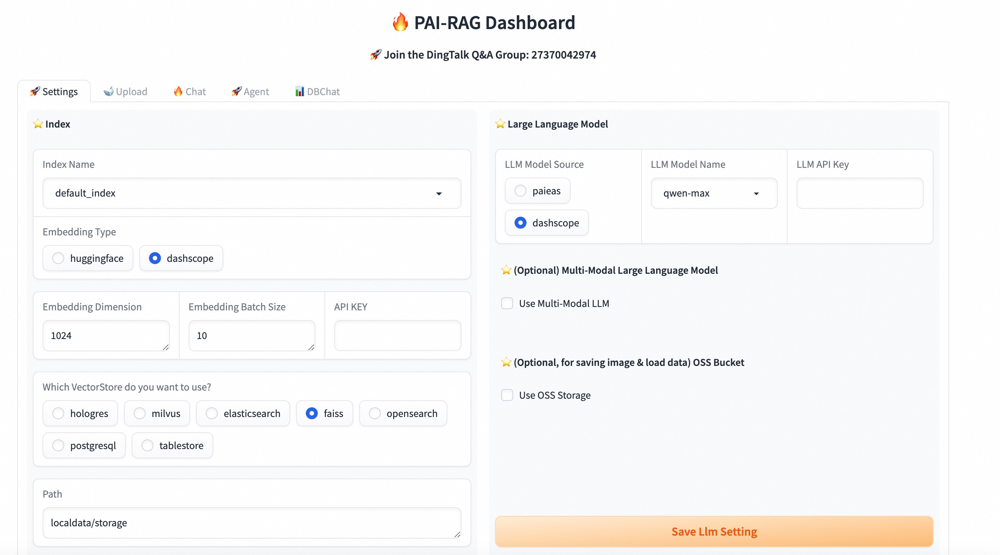
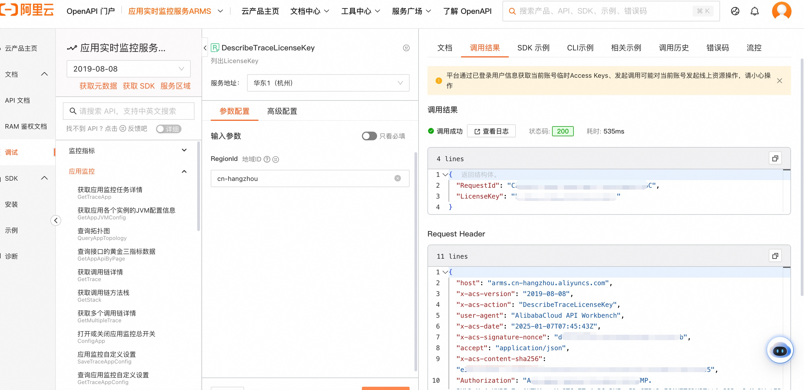

# EAS一键部署RAG服务

模型在线服务EAS（Elastic Algorithm Service）是阿里云PAI产品为实现一站式模型开发部署应用，针对在线推理场景提供的模型在线服务，支持将模型服务部署在公共资源组或专属资源组，实现基于异构硬件（CPU和GPU）的模型加载和数据请求的实时响应。

这里介绍一下如何在EAS快速部署PAI-RAG服务。

## 准备工作

1. 创建一个专有网络(VPC)、交换机和安全组。
2. 【可选】如果使用通义千问大模型服务API，可以申请一个DASHSCOPE_API_KEY，获取地址为 https://dashscope.console.aliyun.com/apiKey。

## EAS自定义部署

1. 进入EAS控制台，选择**自定义部署**


2. 进入配置页面，填写服务名称，并勾选**开启Web应用**


3. 选择服务资源

RAG服务可以部署CPU和GPU版本，GPU版本在pdf文档解析、embedding计算、reranker模型推理等模块有明显速度优势，如果对响应速度有要求，建议部署GPU版本。

- CPU RAG服务：建议配置CPU资源为8核以上，内存为16GB以上。推荐选择**ecs.g6.2xlarge**，**ecs.g6.4xlarge**等机型。
- GPU RAG服务：建议配置GPU显存为16GB以上。推荐选择**A10显卡**或者**GU30显卡**, 比如**ecs.gn7i-c16g1.4xlarge**、**ml.gu7i.c16m60.1-gu30**机型。


4. 配置VPC

EAS服务默认不通公网，在访问通义千问大模型服务API或者访问云向量数据库时，需要配置VPC，请参考[EAS配置公网连接](https://help.aliyun.com/zh/pai/user-guide/configure-network-connectivity#1d893e761dnkz)。


5. 编辑自定义json

RAG服务包含三个核心镜像，API服务镜像、Web UI镜像和Nginx镜像。，您需要点击**编辑**，调整自定义JSON中的`containers`字段内容。

>

这里以hangzhou region为例，给出"containers"字段对应的镜像示例。如果你在别的region，请参考[地域和可用区列表](https://help.aliyun.com/document_detail/40654.html#09f1dc16b0uke)，修改镜像url中的region名称。

CPU版本镜像配置：

```json
{
  "containers": [
    {
      "image": "eas-registry-vpc.cn-hangzhou.cr.aliyuncs.com/pai-eas/pai-rag:0.1-nginx",
      "port": 8000,
      "script": "/docker-entrypoint.sh nginx"
    },
    {
      "image": "eas-registry-vpc.cn-hangzhou.cr.aliyuncs.com/pai-eas/pai-rag:0.1-ui",
      "port": 8002,
      "script": "pai_rag ui"
    },
    {
      "image": "eas-registry-vpc.cn-hangzhou.cr.aliyuncs.com/pai-eas/pai-rag:0.1",
      "port": 8001,
      "script": "pai_rag serve"
    }
  ]
}
```

GPU版本镜像配置：

```json
{
  "containers": [
    {
      "image": "eas-registry-vpc.cn-hangzhou.cr.aliyuncs.com/pai-eas/pai-rag:0.1-nginx",
      "port": 8000,
      "script": "/docker-entrypoint.sh nginx"
    },
    {
      "image": "eas-registry-vpc.cn-hangzhou.cr.aliyuncs.com/pai-eas/pai-rag:0.1-ui",
      "port": 8002,
      "script": "pai_rag ui"
    },
    {
      "image": "eas-registry-vpc.cn-hangzhou.cr.aliyuncs.com/pai-eas/pai-rag:0.1-gpu",
      "port": 8001,
      "script": "pai_rag serve"
    }
  ]
}
```

编辑完成的JSON示例如下：


6. 点击部署，等待服务创建完成。

查看Web应用确认服务是否部署成功。


看到如下界面，表示部署完成，可以开始使用RAG服务了。



## 可选：配置EAS链路追踪

EAS服务本身集成了基于OpenTelementry标准实现的自动化埋点功能，支持追踪LLM服务的链路数据，更直观的调试和分析不同操作类型的输入输出、Token消耗等信息。

### 准备工作

1. 已开通ARMS应用监控。具体操作，请参见[开通ARMS](https://help.aliyun.com/zh/arms/getting-started/activate-arms)。
2. 通过[DescribeTraceLicenseKey接口](https://help.aliyun.com/zh/arms/application-monitoring/developer-reference/api-arms-2019-08-08-describetracelicensekey-apps?spm=a2c4g.11186623.0.0.34591233xYEKmO)获取ARMS license key.



### 配置EAS服务

1. 进入EAS服务页面，点击**更新**，进入更新服务页面, 修改JSON。添加如下配置：

- api镜像新增三个环境变量
  - `ARMS_APP_NAME`：ARMS接入应用名称，需要与EAS服务名称保持一致。
  - `ARMS_REGION_ID`：ARMS应用所在地域ID。例如华东1（杭州）为`cn-hangzhou`。
  - `ARMS_LICENSE_KEY`：刚刚获取的ARMS license key。
- 新增标签：`EnableTrace: true`


配置完成，更新服务。

2. 进入ARMS管控台的[应用列表](https://arms.console.aliyun.com/#/tracing/list),找到对应应用名称，修改采样百分比为100%（否则链路不完整，无法记录成功）。


3. 返回EAS服务页面，会发现新增了**链路追踪**标签。点进去可以查看对话信息。


