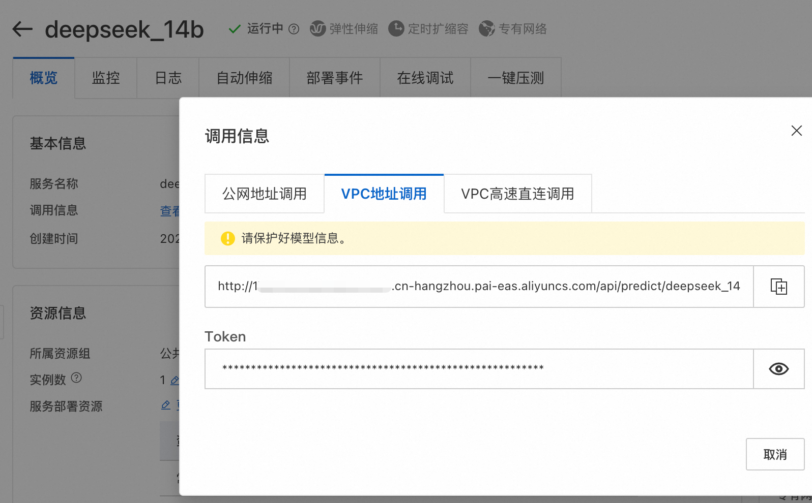
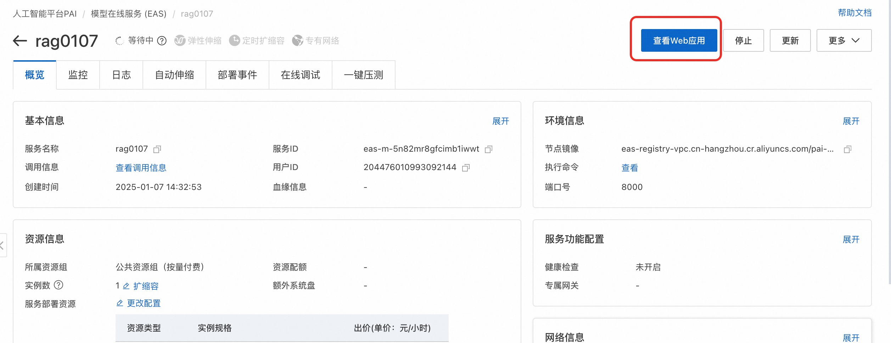
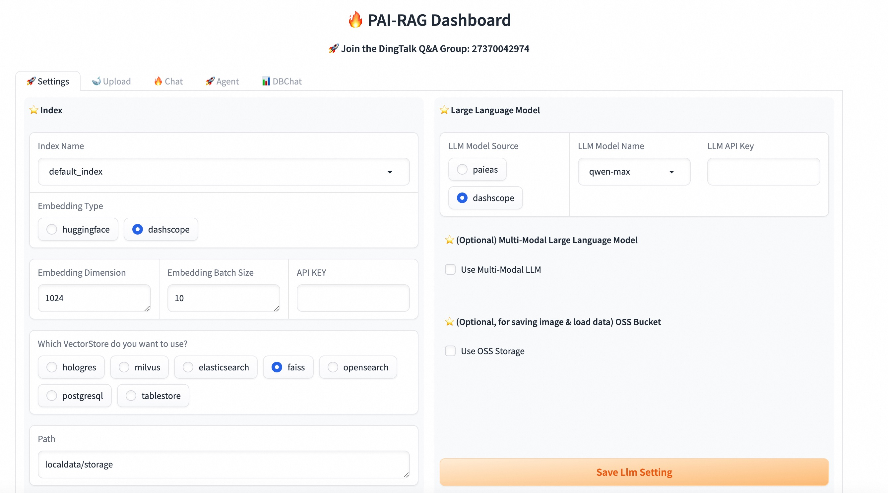
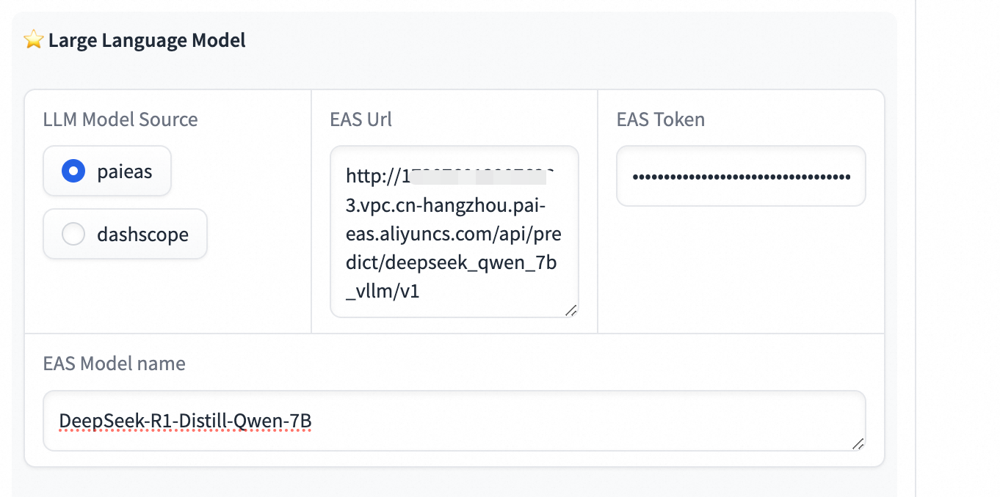
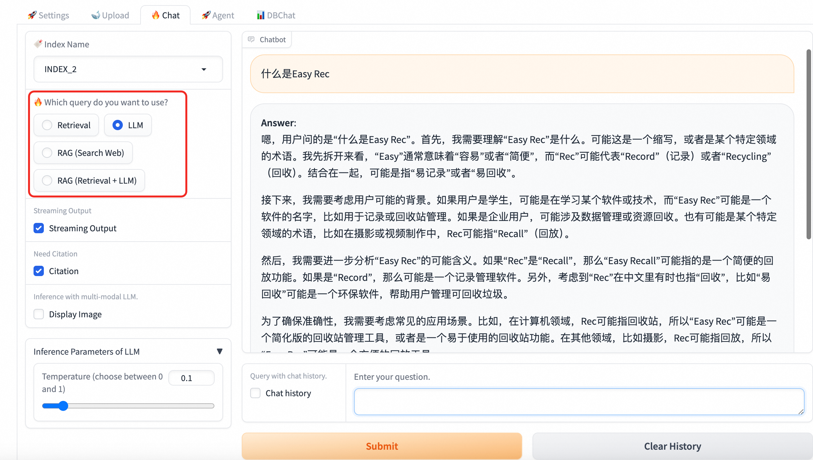
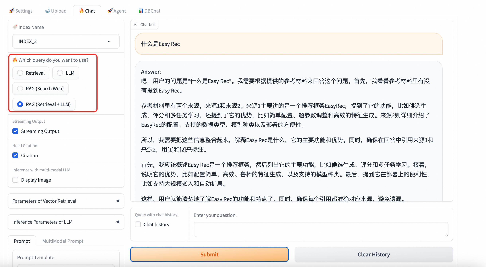

# EAS部署RAG服务

模型在线服务EAS（Elastic Algorithm Service）是阿里云PAI产品为实现一站式模型开发部署应用，针对在线推理场景提供的模型在线服务，支持将模型服务部署在公共资源组或专属资源组，实现基于异构硬件（CPU和GPU）的模型加载和数据请求的实时响应。

这里我们介绍通过EAS来部署DeepSeek大模型+PAI-RAG服务来快速搭建知识库问答机器人。

## 准备工作

1. 创建一个专有网络(VPC)、交换机和安全组。

## EAS部署DeepSeek大模型

DeepSeek-V3是由DeepSeek推出的一款拥有6710亿参数的专家混合（MoE）大语言模型，DeepSeek-R1是基于DeepSeek-V3-Base训练的高性能推理模型。

EAS服务支持部署如下的模型列表和最低配置。
详细部署流程可以参考[一键部署DeepSeek-V3、DeepSeek-R1模型](https://help.aliyun.com/zh/pai/user-guide/one-click-deployment-deepseek-v3-model),
这里注意选择准备好的VPC、交换机和安全组信息。

<table>
  <tr>
    <th>模型</th>
    <th>部署方式</th>
    <th>最低配置</th>
  </tr>
  <tr>
    <td>DeepSeek-V3</td>
    <td><li>vLLM加速部署<li>标准部署</td>
    <td>8卡 GU120 (8 * 96 GB显存)</td>
  </tr>
  <tr>
    <td>DeepSeek-R1</td>
    <td><li>标准部署</td>
    <td>8卡 GU120 (8 * 96 GB显存)</td>
  </tr>
  <tr>
    <td>DeepSeek-R1-Distill-Qwen-1.5B</td>
    <td rowspan="6"><li>BladeLLM加速部署<li>vLLM 加速部署<li>标准部署</td>
    <td rowspan="3">1卡 A10 (24 GB显存)</td>
  </tr>
  <tr>
    <td>DeepSeek-R1-Distill-Qwen-7B</td>
  </tr>
  <tr>
    <td>DeepSeek-R1-Distill-Llama-8B</td>
  </tr>
  <tr>
    <td>DeepSeek-R1-Distill-Qwen-14B</td>
    <td>1卡 GPU L (48 GB显存)</td>
  </tr>
  <tr>
    <td>DeepSeek-R1-Distill-Qwen-32B</td>
    <td>1卡 GU120 (96 GB显存)</td>
  </tr>
  <tr>
    <td>DeepSeek-R1-Distill-Llama-70B</td>
    <td>2卡 GU120 (2 * 96 GB显存)</td>
  </tr>
</table>

部署完成后点击**查看调用信息**，



记录deepseek调用信息：

- **VPC调用地址**: API调用地址，VPC调用地址可在同一个VPC内访问
- **Token**: API_KEY
- **模型名称**: 部署的模型名称，可参考上述表格

## EAS 自定义部署PAI-RAG服务

1. 进入EAS控制台，点击**部署服务**，选择**JSON独立部署**。

2. 进入配置页面，填写如下JSON模板。

```json
{
  "cloud": {
    "computing": {
      "instances": [
        {
          "type": "ecs.c6.4xlarge"
        }
      ]
    },
    "networking": {
      "security_group_id": "sg-bp1ggpdck0vqgve873vp",
      "vpc_id": "vpc-bp15lffuvfo9ohff8z067",
      "vswitch_id": "vsw-bp11m6ptm2boe7qpckg8k"
    }
  },
  "containers": [
    {
      "image": "eas-registry-vpc.cn-hangzhou.cr.aliyuncs.com/pai-eas/pai-rag:0.1-nginx",
      "port": 8000,
      "script": "/docker-entrypoint.sh nginx"
    },
    {
      "image": "eas-registry-vpc.cn-hangzhou.cr.aliyuncs.com/pai-eas/pai-rag:0.1-ui",
      "port": 8002,
      "script": "pai_rag ui"
    },
    {
      "env": [
        {
          "name": "PAIRAG_RAG__embedding__source",
          "value": "huggingface"
        }
      ],
      "image": "eas-registry-vpc.cn-hangzhou.cr.aliyuncs.com/pai-eas/pai-rag:0.1",
      "port": 8001,
      "script": "pai_rag serve"
    }
  ],
  "labels": {
    "PAI_RAG_VERSION": "0.1_custom"
  },
  "metadata": {
    "cpu": 16,
    "enable_webservice": true,
    "instance": 1,
    "memory": 32000,
    "name": "pai_rag_123"
  }
}
```

> [!NOTE]
> 这里的模板是使用CPU资源的模板，如果上传文件较多、对检索延迟要求较高，建议使用下面的[GPU加速版本的模板](#gpu加速版pai-rag部署模板)，文档解析和embedding计算速度快很多。

3. 修改并完善模板配置

- 配置网络：选择与DeepSeek服务部署相同的VPC，交换机和安全组信息，对应`networking`字段中的`security_group_id`,`vpc_id`,和`vswitch_id`。
- 修改服务名称：修改`metadata`字段中的`name`字段，用于标识服务名称，注意这里只能使用小写字母+数字+下划线组成。
- 修改镜像region（杭州region部署不需要改）：修改`image`字段中的region名称，默认为`cn-hangzhou`，如果部署区域不是杭州，请修改为部署区域对应的region名称。请参考[地域和可用区列表](https://help.aliyun.com/document_detail/40654.html#09f1dc16b0uke)，修改镜像url中的region名称。

4. 点击部署，等待服务创建完成。

查看Web应用确认服务是否部署成功。



看到如下界面，表示部署完成，可以开始使用RAG服务了。



5. 配置RAG使用DeepSeek服务

在Web应用中，LLM选择**paieas**，
EAS Url填入部署完成的DeepSeek模型的**VPC调用地址**（url最后需加上/v1后缀），
Token选择DeepSeek模型的调用**Token**。

如果是vllm部署，模型名称需填入上述模型名字，其他部署模式直接填**default**即可。



6. 使用DeepSeek-API

在Web应用中，点击Chat分页可使用DeepSeek-API即可使用DeepSeek-API进行问答。

- 直接选择LLM进行通用对话



- 使用RAG服务进行知识库问答



- 调用RAG服务API，可以参考[PAI-RAG API文档](https://help.aliyun.com/zh/pai/user-guide/deploy-a-rag-based-dialogue-system?spm=a2c4g.11186623.help-menu-30347.d_2_3_8_6_3.65af3c57DWWCnq&scm=20140722.H_2773218._.OR_help-T_cn~zh-V_1#02d735266ef7x)

- 发布到微信公众号、钉钉、企业微信机器人，可以参考阿里云文档 [PAI-RAG+钉钉](https://help.aliyun.com/zh/pai/use-cases/build-ai-robot-with-pai-and-integrate-into-dingtalk-with-appflow?spm=a2c4g.11186623.help-menu-30347.d_3_3_6.19337652fhEybm), [PAI-RAG+企业微信](https://help.aliyun.com/zh/pai/use-cases/building-ai-assistant-based-on-appflow-integration-enterprise-wechat-and-pai-rag?spm=a2c4g.11186623.help-menu-30347.d_3_3_8.b6883c57pIYIE2)、[PAI-RAG+微信公众号](https://help.aliyun.com/zh/pai/use-cases/integrating-wechat-public-account-and-rag-to-build-intelligent-customer-service?spm=a2c4g.11186623.help-menu-30347.d_3_3_7.18ce3c57eCd6QR)

### 常见问题

##### 1. 配置完DeepSeek调用API，查询访问超时并报错。

Answer: 请检查DeepSeek服务调用地址是否可以访问。如果当前RAG服务已经开通公网，则直接填入公网调用地址。没有开通公网，请确认两个服务在同一个VPC内。开通公网可参考[EAS配置公网连接](https://help.aliyun.com/zh/pai/user-guide/configure-network-connectivity#1d893e761dnkz)。

##### 2. 配置完DeepSeek调用API，没有超时，直接报错。

Answer: 请检查模型名称是否正确，VLLM部署的模型名称需要保证完全一致（区分大小写），其他部署模式模型名称为`default`。

##### 3. 向量数据库该怎么选择？

Answer: 默认提供了FAISS选项，数据存在本地，**服务重启数据会丢失**，需要重新上传。如果挂载了OSS存储，会把数据传到OSS中，服务重启还会保存。推荐使用FAISS来做测试，正式使用建议使用Elasticsearch，Milvus等云上托管向量库。

##### 4. 服务重启，配置怎么没有了？需要重新配置。

Answer: 服务配置信息默认存在本地，服务重启会丢失。如果挂载了OSS存储，会把数据传到OSS中，服务重启还会保存。挂载方式见[挂载OSS存储](#挂载oss存储)

### 附录

#### 挂载OSS存储

1. 在同一region创建OSS存储桶，假设bucket名字为`pai-rag`。
2. JSON中加入"storage"配置，如下所示

```json
{
  "storage": [
    {
      "mount_path": "/app/localdata",
      "oss": {
        "path": "oss://pai-rag/rag_0207/",
        "readOnly": false
      },
      "properties": {
        "resource_type": "model"
      }
    }
  ]
}
```

3. 把oss的path替换为自己的oss bucket和path。

#### GPU加速版PAI-RAG部署模板

```json
{
  "cloud": {
    "computing": {
      "instances": [
        {
          "type": "ml.gu7i.c16m60.1-gu30"
        }
      ]
    },
    "networking": {
      "security_group_id": "sg-bp1ggpdck0vqgve873vp",
      "vpc_id": "vpc-bp15lffuvfo9ohff8z067",
      "vswitch_id": "vsw-bp11m6ptm2boe7qpckg8k"
    }
  },
  "containers": [
    {
      "image": "eas-registry-vpc.cn-hangzhou.cr.aliyuncs.com/pai-eas/pai-rag:0.1-nginx",
      "port": 8000,
      "script": "/docker-entrypoint.sh nginx"
    },
    {
      "image": "eas-registry-vpc.cn-hangzhou.cr.aliyuncs.com/pai-eas/pai-rag:0.1-ui",
      "port": 8002,
      "script": "pai_rag ui"
    },
    {
      "env": [
        {
          "name": "PAIRAG_RAG__embedding__source",
          "value": "huggingface"
        }
      ],
      "image": "eas-registry-vpc.cn-hangzhou.cr.aliyuncs.com/pai-eas/pai-rag:0.1-gpu",
      "port": 8001,
      "script": "pai_rag serve"
    }
  ],
  "labels": {
    "PAI_RAG_VERSION": "0.1_custom"
  },
  "metadata": {
    "cpu": 16,
    "enable_webservice": true,
    "gpu": 1,
    "instance": 1,
    "memory": 60000,
    "name": "pai_rag_test_gpu"
  }
}
```
