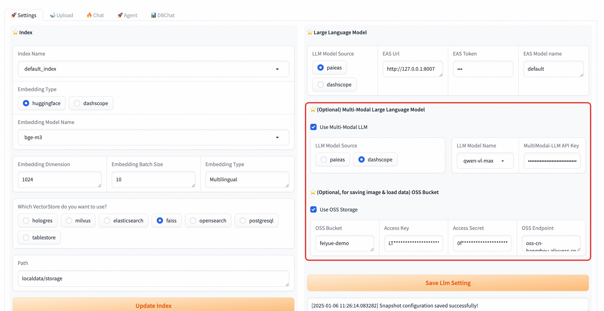

# 多模态问答

很多时候，知识库的文档中不只是纯文本信息，还包含很多图文交错的pdf、word、markdown等文件，甚至一些海报之类的纯图片文件。
普通的RAG流程会忽略这些图片输入，仅仅使用文本信息，这样会出现很多信息丢失的情况。
这里我们通过使用多模态模型来实现图文混合的多模态问答。

## 配置多模态LLM和Aliyun OSS存储

首先我们需要配置多模态LLM，这里我们推荐使用DASHSCOPE VLLM，或者部署在PAI-EAS的兼容openai协议的VLLM模型，比如开源的qwen2-vl。

然后需要添加一个Aliyun的OSS存储，来存储图片文件信息。这样在结果输出时，可以通过图片链接的方式在回复中展示图片。

配置示例如图, 配置完保存即可。

## 上传多模态文件

这里支持多种多模态文件格式，包括pdf, markdown, word, ppt, png, jpg等。

这里需要勾选`Process with MultiModal` 选项才会处理文件中的图片信息，处理pdf时，建议勾选`Process PDF with OCR` 选项。

## 问答测试

勾选`Display Image`选项，就可以进行多模态问答。

同时，你可以调整下方的Multimodal Prompt来优化问答提示词。

